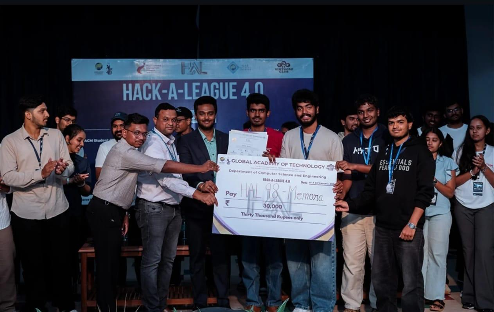
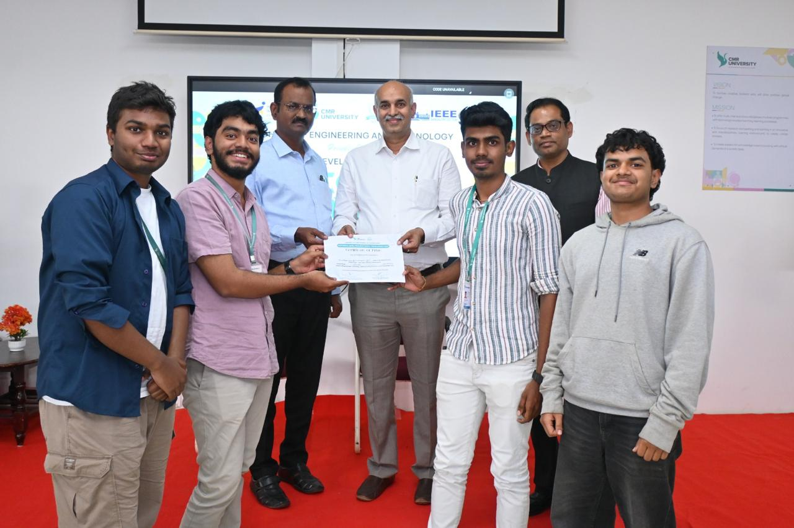
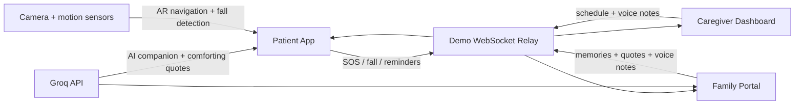

# Memora: AI Dementia Companion

<p align="center">
  <strong>An award-winning AI, AR, and realtime care companion for dementia patients, caregivers, and families.</strong>
</p>

<p align="center">
  
  
  
  
  
</p>

---

## Project Snapshot

**Memora** is a full-stack prototype built for one of healthcare's most human problems: helping people living with dementia stay safer, calmer, and more connected while giving caregivers and family members timely context.

The app combines a simplified patient interface, sensor-based safety features, an AI companion, voice messaging, realtime dashboards, memory sharing, and AR-assisted indoor navigation into one coordinated experience.

| Built For | What It Solves |
| --- | --- |
| Patients | Gentle reminders, companionship, memory support, safe navigation, emergency help |
| Caregivers | Daily schedule management, SOS/fall alerts, realtime visibility, voice communication |
| Family | Emotional connection, memory sharing, comforting AI-assisted messages, activity awareness |

## Awards & Recognition

<table>
  <tr>
    <td width="42%">
      
    </td>
    <td>
      <h3>2nd Place - National Level Hackathon</h3>
      <p><strong>Organised by Global Academy of Technology</strong></p>
      <p>Recognized for building a practical AI-assisted care companion focused on dementia support, safety, and family connection.</p>
    </td>
  </tr>
  <tr>
    <td width="42%">
      
    </td>
    <td>
      <h3>3rd Place - National Level Hackathon</h3>
      <p><strong>Organised by Sai Ram College of Engineering</strong></p>
      <p>Awarded for a multi-role healthcare prototype combining patient UX, caregiver coordination, AI support, and realtime alerts.</p>
    </td>
  </tr>
  <tr>
    <td width="42%">
      
    </td>
    <td>
      <h3>2nd Place - National Level Tech-Expo</h3>
      <p><strong>Organised by CMR University</strong></p>
      <p>Presented as a working product concept with mobile sensors, AR navigation, and connected dashboards for dementia care.</p>
    </td>
  </tr>
</table>

## Why This Project Stands Out

- **Real user empathy:** the patient experience is intentionally simple, icon-driven, and low-friction for users who may be disoriented or anxious.
- **Multimodal product thinking:** combines AI chat, speech, audio recording, camera access, motion sensors, notifications, and realtime sync.
- **Safety-oriented UX:** SOS uses a slider to reduce accidental triggers, while fall detection and urgent alerts notify caregiver/family dashboards.
- **Mobile-first engineering:** designed for physical device testing with camera, microphone, accelerometer, gyroscope, local notifications, and Android packaging through Capacitor.
- **Presentation-ready demo system:** includes a lightweight WebSocket relay server for multi-device demos across Patient, Caregiver, and Family views.

## Core Experience



## Feature Highlights

### Patient View

| Feature | Recruiter-Relevant Detail |
| --- | --- |
| AR home navigation | Camera-based navigation surface with compass calibration, heading smoothing, step detection, and real-world bearing math |
| AI companion, "Digi" | Groq-powered conversational support with voice/text input paths and graceful text-only fallback |
| Daily reminders | Accessible reminder flow for medication, meals, hydration, and routine prompts |
| Memory album | Family-shared photos and captions shown in a patient-friendly visual album |
| Voice messages | Audio-based connection between patient, family, and caregivers |
| Emergency SOS | Large slider interaction designed to prevent accidental activation |
| Fall detection | Motion sensor-based potential fall trigger routed to caregiver/family alerts |

### Caregiver View

- Urgent alert dashboard for SOS and fall events.
- Schedule management for daily patient reminders.
- Voice mailbox for caregiver-patient-family communication.
- Shared state updates for coordinated multi-role demos.

### Family View

- Activity timeline for patient events and care context.
- Memory sharing with image upload and captions.
- AI-generated comforting thoughts powered by Groq.
- Voice messages, schedule visibility, and urgent alert awareness.

## Technical Architecture

| Layer | Implementation |
| --- | --- |
| Frontend | React 18, TypeScript, Vite, Tailwind CSS |
| State | React Context reducer-based app state in `src/context/` |
| AI | Groq API routed through backend/demo server endpoints |
| Realtime | WebSocket service and isolated Express demo relay in `demo-server/` |
| Native/mobile | Capacitor Android, local notifications, native voice/audio integrations |
| Sensors | Camera, DeviceOrientation, DeviceMotion, accelerometer-based fall/step flows |
| Testing | Vitest unit tests for reducer/routing/AI companion behavior; Playwright available for E2E |

## Repository Structure

```text
src/
  components/
    patient/      Patient-first mobile flows: AR, AI companion, reminders, memory album
    caregiver/    Caregiver dashboard and schedule management
    family/       Family portal, memory sharing, quotes, timeline
    shared/       Cross-role UI and notification components
    icons/        Local icon components
  context/        Global state, reducer, remote action routing
  hooks/          Device and browser capability hooks
  services/       AI, realtime WebSocket, notifications, audio, speech
  assets/         Audio assets used for alerts and voice demos

demo-server/      Express + WebSocket relay for multi-device presentations
public/           Static browser assets
scripts/          Verification and tunnel helper scripts
```

## Technical Details

Memora includes several implementation details that go beyond a standard CRUD-style app:

- **AR navigation:** uses camera access, `deviceorientation`, heading smoothing, compass calibration, and relative bearing math to guide a patient indoors.
- **Step and fall signals:** reads motion sensor data through `devicemotion` for step detection and potential fall alert flows.
- **Realtime care loop:** broadcasts important events through the demo WebSocket relay so Patient, Caregiver, and Family views stay in sync during presentations.
- **AI boundary:** routes Groq-powered AI companion and quote generation through server endpoints so API keys stay out of the browser bundle.
- **Native-ready mobile path:** supports Capacitor Android builds with local notifications, voice features, and physical-device testing.

## Getting Started

### Prerequisites

- Node.js 18 or newer
- npm
- Groq API key from [Groq Console](https://console.groq.com/keys)
- Android Studio for native Android builds
- `mkcert` for trusted HTTPS mobile browser testing

### Install

```bash
git clone https://github.com/your-username/memora-app.git
cd memora-app
npm install
```

### Configure Groq

For local development with the demo server, put the Groq key in `demo-server/.env` or your shell:

```bash
GROQ_API_KEY=YOUR_GROQ_API_KEY
```

Optional environment variables:

```bash
GROQ_MODEL=llama-3.1-8b-instant
VITE_AI_API_BASE_URL=http://localhost:8081
```

## Run Locally

### Frontend

```bash
npm run dev
```

Open the HTTPS local URL printed by Vite, usually `https://localhost:5173`.

### Demo WebSocket Server

```bash
npm --prefix demo-server install
npm --prefix demo-server start
```

Use this when presenting multiple devices or browser windows as Patient, Caregiver, and Family.

### Build

```bash
npm run build
```

## Mobile Device Testing

Camera, motion sensors, microphone, and notification flows should be tested on a real device.

```bash
mkcert -install
mkcert localhost
npm run dev
```

Then open the Vite network URL on a phone connected to the same Wi-Fi network and grant the requested permissions.

## Android Build

This project uses Capacitor v7.

```bash
npm install
npm run build
npx cap sync android
npx cap open android
```

Build the APK from Android Studio via **Build > Build Bundle(s) / APK(s) > Build APK(s)**. The generated debug APK is usually located at:

```text
android/app/build/outputs/apk/debug/app-debug.apk
```

For native voice verification and sync:

```bash
npm run build:android
```

## Validation

```bash
npm run build
npm run test:run
npm run verify:voice
```

Manual validation should cover reminders, SOS/fall alert routing, Groq AI responses, voice playback, AR navigation on a physical mobile device, and multi-device sync through `demo-server/`.

## Engineering Highlights

- Designing an accessible patient UI for cognitive load, not just visual polish.
- Handling browser/native capability differences across speech, sensors, camera, and notifications.
- Routing AI calls through a backend boundary instead of exposing the Groq key in the client bundle.
- Building a realtime demo architecture that is simple enough for hackathon presentation but structured enough to evolve.
- Using deterministic AR debug cases to validate device-heading math.

## Team Achievement

Memora was built as a competition project and recognized across multiple national-level events. The project reflects fast product execution, technical breadth, and a strong focus on healthcare impact.

---

<p align="center">
  <strong>Memora</strong> - AI-assisted care, safer routines, and stronger family connection for dementia support.
</p>
